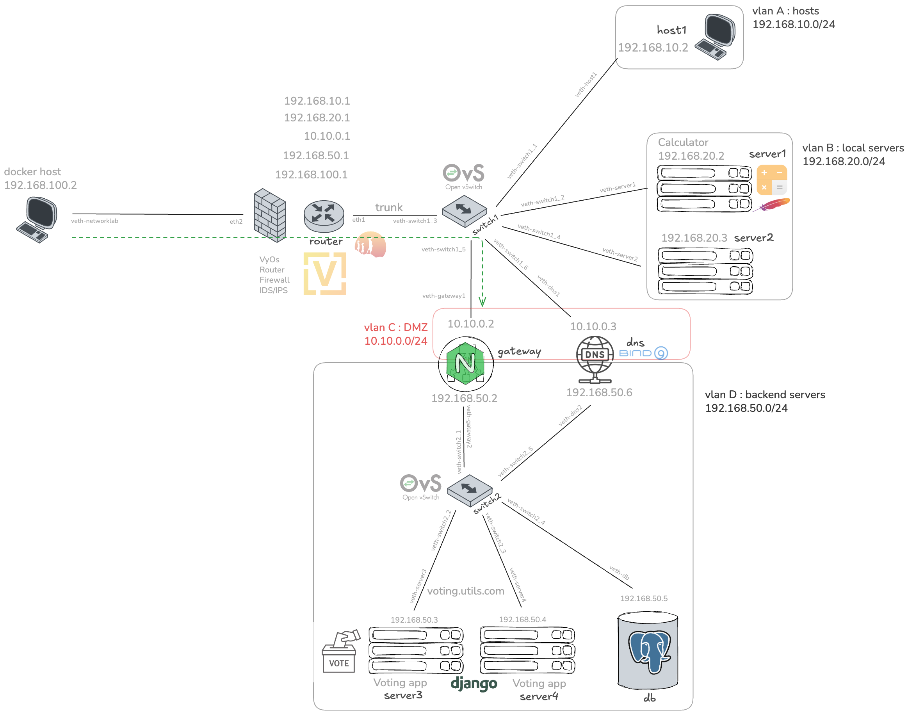

# Docker Network Lab

This project creates a Docker-based network lab that includes key network devices configured with essential settings. The main objective was to build a practical environment for hands-on practice with network configurations, as well as to provide a platform for testing and experimenting with cybersecurity attacks.

## Overview



The technologies and devices used in this lab are containerized and carefully chosen to closely resemble an enterprise network environment.  
- **VyOS** is used as the router, firewall, and IDS/IPS (including Suricata).  
- **Open vSwitch** simulates the network switches.

The network topology includes **4 VLANs** with distinct roles:  
- **VLAN 10**: Local hosts  
- **VLAN 20**: Local server:  
  - Calculator, a simple web app based on Apache HTTP server  
- **VLAN 30**: DMZ (accessible from the external network, i.e., the Docker host machine):  
  - NGINX server acting as a load balancer, WAF, and TLS terminator. The load balancer distributes traffic for a voting application hosted on two identical backend servers (server3 and server4)  
  - DNS server running Bind9  
- **VLAN 50**: Backend, hidden behind the DMZ:  
  - Voting app, built with Django and using PostgreSQL for its database


## Usage

To run this environment, you need a Linux AMD64 system.  
Start the lab by running:

```bash
sudo ./run.sh
```
*Note*: Sudo is required due to the network configuration steps involved. Feel free to review the run.sh script yourself for security reasons!
